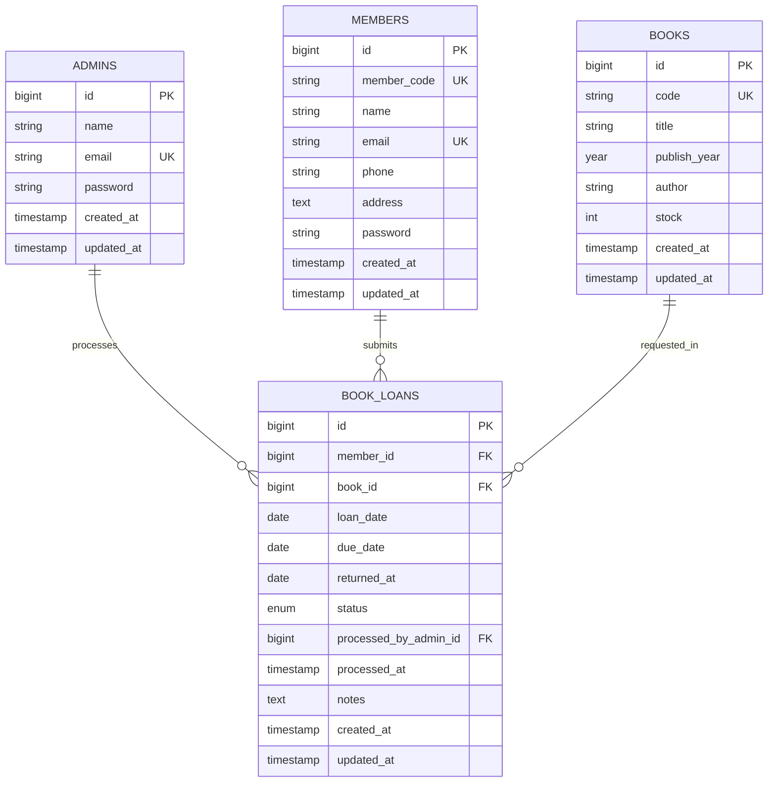

# ERD Aplikasi Peminjaman Buku

Aplikasi diimplementasikan hanya untuk fitur yang diminta pengguna, tetapi rancangan database ini sudah mengakomodasi seluruh requirement termasuk approval, reject, dan pengembalian buku.

## Catatan desain
- `book_loans.status` memakai nilai `pending`, `approved`, `rejected`, `returned` agar satu tabel cukup untuk pengajuan, peminjaman aktif, dan histori pengembalian.
- `processed_by_admin_id` dan `processed_at` dipakai saat fitur approval/reject dan pengembalian diaktifkan nanti.
- `books.stock` disimpan langsung di tabel buku agar pembacaan katalog lebih sederhana dan cepat.
